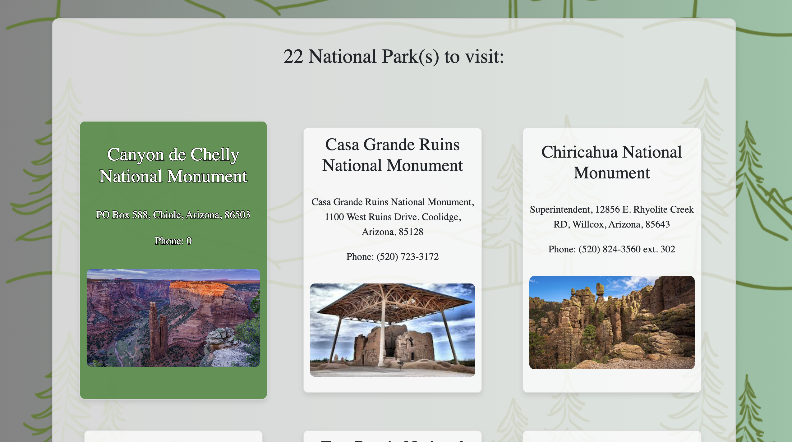
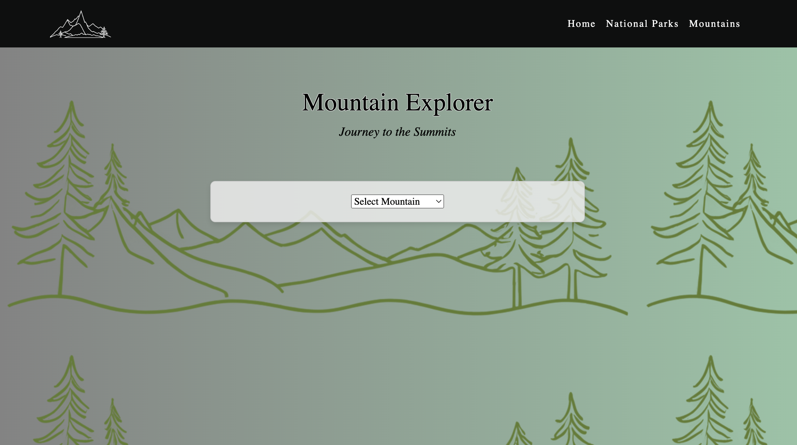

## Summit-Seekers_capstone2

Capstone 2 National Parks website.

## About

This project is an interactive website designed to inspire and inform outdoor enthusiasts about America's national parks and mountains. The website provides users with information on various national parks and mountains, including key details, images, and the ability to filter and search for specific parks or mountains.

## Features

Homepage: Features a carousel with images of national parks, welcoming users to the site.
National Parks Explorer: Allows users to search for national parks by state, park type, or park name. The results display information and a link to the park's website.
Mountains Explorer: Provides details on various mountains, the elevation, description, and coordinates. Users can also view the sunrise and sunset times for each mountain.

## Project Pages

Homepage

National Parks Explorer

Mountains Explorer

## Interesting JavaScript Code

One of the most interesting pieces of JavaScript in this project is the functionality to load and display information about mountains, including fetching sunrise and sunset times using an external API. This functionality is implemented in mountains.js:

